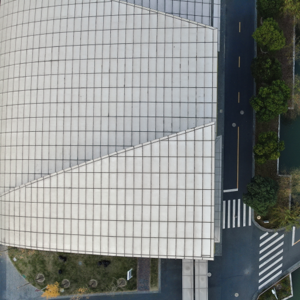
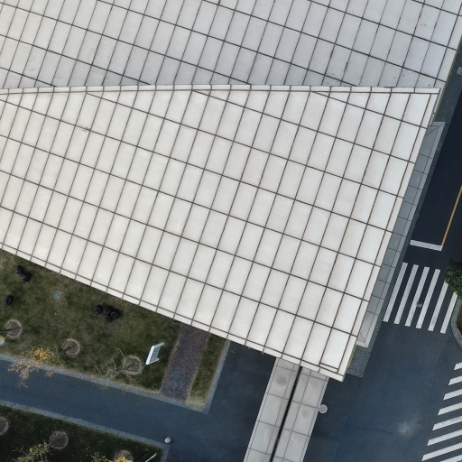
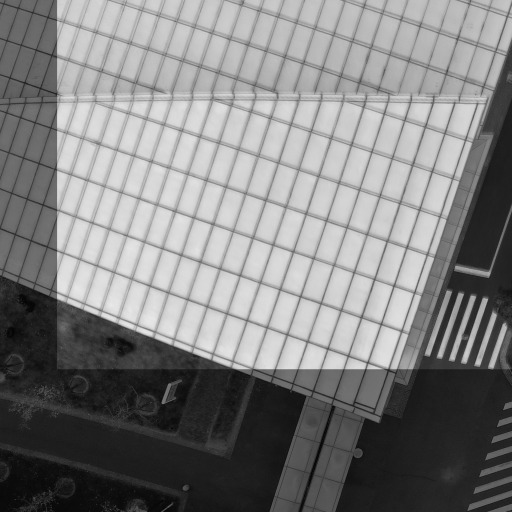

<p float="center">
  
   
  
</p>

## Dependencies
* fftw3
* OpenCV 4.2
* Eigen
* Ceres

## Compile
```bash
    mkdir build && cd build
    cmake -DCMAKE_BUILD_TYPE=Release ..
    make
```
### Mac OS X
  `cmake -DCMAKE_BUILD_TYPE=Release -DCMAKE_CXX_FLAGS='-isystem /usr/local/include' ..`

## Run
```bash
./image_main <path to load images> output/<path to save results>
```
the input directory structure are like this
```
- <data_dir>
  - Images (this is a directory)
  - cam_param.yaml (the format is like the below part)
  - imageList.txt (each line is the name of image in Images. you can generate this file with `ls Images > imageList.txt` in <data_dir>)
  - timestamps.txt (the content of this is not necessary)
```
cam_param.yaml
```yaml
%YAML:1.0

Camera.type: "PinHole"

Camera.fx: 2955.7
Camera.fy: 2949.9
Camera.cx: 2023.1
Camera.cy: 1510.7

Camera.k1: 0.1601
Camera.k2: -0.3277
Camera.p1: -0.00073991
Camera.p2: 0.0051

Camera.width: 4056
Camera.height: 3040
```
Noted, there should be a directory `txt` under `output`.


License
-------
This project is licensed under the [GPLv3 License](LICENSE). The license of the original Python version by Gohlke and Týč can be found [here](LICENSE-ORIGINAL).
